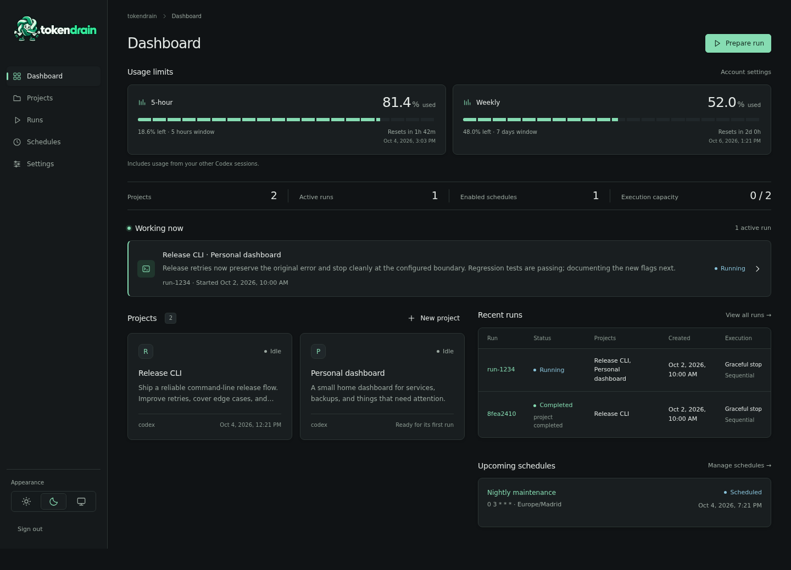
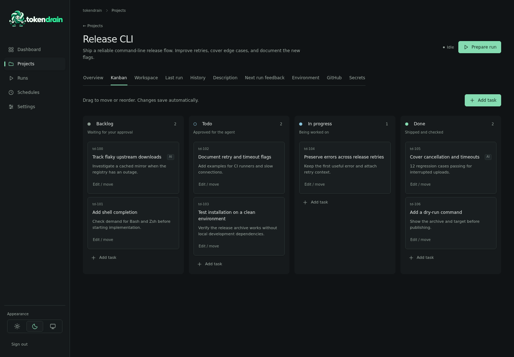

<h1 align="center">
  <picture>
    <source media="(prefers-color-scheme: dark)" srcset="docs/assets/tokendrain-logo-horizontal-dark.png">
    <source media="(prefers-color-scheme: light)" srcset="docs/assets/tokendrain-logo-horizontal.png">
    
  </picture>
</h1>

**You're already paying OpenAI for the tokens. Let's use the fucking tokens.**

Your Codex usage windows reset whether you use them or not. tokendrain gives the leftovers a job: software work you've approved, running unsupervised until it finishes, gets blocked, or reaches the limits you choose.



## What is tokendrain?

tokendrain is a self-hosted NixOS service that runs Codex on your software projects. Give a project a goal and approved tasks; Codex works inside an isolated Firecracker VM. The workspace and installed tools survive between Runs. You decide what gets worked on and how much remaining usage to spend.

## What it actually does

- Works **In progress** and **Todo** Kanban tasks. Discoveries go to **Backlog**, waiting for your approval.
- Keeps your source files, development tools, and caches between Runs.
- Runs Codex without command approval prompts inside isolated Firecracker VMs.
- Reads the provider's actual usage windows and reset times.
- Stops at your usage thresholds, with either a short wrap-up or hard interruption.
- Gives each project selected GitHub repository permissions, if you want them.
- Keeps generated work in the Workspace even without GitHub. Browse files and previews while idle; download individual files, folders as ZIP, or the whole Workspace as ZIP.
- Starts Runs now or on timezone-aware cron schedules.

## Projects, tasks, Runs



```text
Project
├── Description      what you want built or fixed
├── Kanban
│   ├── Backlog      ideas / AI discoveries waiting for you
│   ├── Todo         approved work
│   ├── In progress
│   └── Done
├── Workspace        source files and results
└── Environment      installed tools, home, caches

Run
└── Fresh VM per selected project
    └── Codex works approved tasks
```

Codex resumes **In progress** first, then takes **Todo**. It can add discoveries to Backlog, but only you can promote them into approved work. The host enforces that rule. No approved tasks left? Stop. There is no prize for inventing busywork.

The VM is thrown away after execution; the project's disks stay. Leave feedback for the next Run when you want to change direction. Execution outcomes and the last valid agent checkpoint are kept separately, so cancelling work doesn't rewrite what the agent last reported.

## Usage limits

Accounts don't all have the same limits. tokendrain reads the windows reported by Codex/OpenAI instead of assuming fixed 5-hour and weekly pools. Pick conditions such as:

```text
Stop when 5-hour usage reaches 95%
Stop when weekly usage reaches 80%
Stop after 4 hours
Stop when no approved work remains
```

The first matching condition stops the Run. Usage includes other Codex sessions on the account, too.

**Graceful stop** is the default. Once the threshold is observed, normal work stops and the current turn is interrupted if necessary. Codex gets one wrap-up turn, bounded to 90 seconds, to settle work, save it where appropriate, update tasks, and leave a checkpoint. Then the VM stops. Putting the tools away may use a little more usage.

**Hard limit** interrupts active Codex work and starts no additional model work. Whatever is already on disk stays; there is no cleanup or finalization turn.

Provider reporting isn't instantaneous. A 90% threshold might first be observed at 90.3%. Hard mode means **once tokendrain sees the threshold, it intentionally spends no more tokens**—not that it can stop at exactly `90.000%`.

Reaching a usage limit means the Run stopped. It doesn't mean the project is finished.

### For example

```text
Project: Make my CLI suck less

In progress
  Speed up startup

Todo
  Fix Windows path handling
  Improve shell completion docs

Backlog
  AI · Cache parsed configuration between commands

Run until: weekly usage reaches 90%
Stop mode: Hard limit
```

Codex works the approved tasks. The caching idea waits for you. The reset gets fewer leftovers.

## Install on NixOS

You need NixOS, flakes, and working `/dev/kvm`. If NixOS runs under another hypervisor, expose nested virtualization.

Add the input and module to your system flake, keeping your existing host configuration:

```nix
{
  inputs = {
    nixpkgs.url = "github:NixOS/nixpkgs/nixos-unstable";
    tokendrain.url = "github:FerranAD/tokendrain";
  };

  outputs = { nixpkgs, tokendrain, ... }: {
    nixosConfigurations.my-host = nixpkgs.lib.nixosSystem {
      system = "x86_64-linux";
      modules = [
        ./configuration.nix
        tokendrain.nixosModules.tokendrain
        {
          services.tokendrain = {
            enable = true;
            web = {
              listenAddress = "127.0.0.1";
              port = 8742;
            };
            auth = {
              mode = "token";
              adminTokenFile = "/run/secrets/tokendrain-admin";
            };
            concurrency = 2;
            microvm = {
              hypervisor = "firecracker";
              defaults = {
                vcpus = 4;
                memoryMiB = 4096;
                diskGiB = 40;
              };
              networking.allowLan = false;
            };
          };
        }
      ];
    };
  };
}
```

Supply an admin token of at least 32 characters at that runtime path, for example through agenix or sops-nix. tokendrain doesn't generate it. Token mode without a file fails configuration/startup.

```sh
sudo nixos-rebuild switch --flake /etc/nixos#my-host
sudo systemctl status tokendraind tokendrain-helper
sudo tokendrain doctor
```

Open `http://127.0.0.1:8742` and log in with your token. From another machine:

```sh
ssh -N -L 8742:127.0.0.1:8742 your-nixos-host
```

Behind VPN or reverse-proxy authentication, you can use `services.tokendrain.auth.mode = "none"`. For an HTTPS reverse proxy, set `services.tokendrain.web.publicUrl` to its browser-facing URL and keep the listener private.

Back up the encryption key at `/var/lib/tokendrain-keys/master.key` with your application data. You can supply your own through `masterKeyFile`; see [security and backups](docs/security.md). See [MicroVM operations](docs/microvms.md) for disk sizing and host resource limits.

## First Run

1. Open Settings and import your Codex `auth.json`. Credentials refresh automatically; this isn't a one-hour login. [Authentication details](docs/openai-auth.md).
2. Optionally connect your own [GitHub App](docs/github-app.md), then choose the repository and permissions a project receives. Publishing a branch needs Contents write access; opening a PR needs Pull requests write access.
3. Create a project with a description and Todo tasks. Add any required secrets with descriptions of what they're for.
4. Prepare a Run. Pick projects, models, reasoning levels, stop conditions, and Graceful or Hard behavior.
5. Start it—or save a schedule for later.

Give it work. Let it chew through the usage you'd otherwise leave on the table.

## Usage reminders

Configure **Settings → Notifications** to send reminders through ntfy.sh or your own ntfy server. For example, get an alert when your weekly reset is within 12 hours and at least 80% of your allowance remains. Rules use the provider's observed windows, and reminders do not launch Runs. See [ntfy setup and delivery behavior](docs/notifications.md).

## The VM is the security boundary

**Codex is intentionally unrestricted inside its project VM.** It has root and no command approval prompts. Any code in that guest can read the project's runtime secrets.

Host, project, and default LAN isolation are enforced outside the agent. Managed credentials are scoped and runtime-only where practical; that doesn't stop guest root from copying them. Grant credentials accordingly. Read the [security model](docs/security.md).

## Operations

```sh
tokendrain status
tokendrain projects
tokendrain runs
tokendrain doctor

sudo journalctl -u tokendraind -u tokendrain-helper -f
```

In token mode, API commands need access to the configured token file; on the host, use `sudo -u tokendrain tokendrain status` if necessary. Use `sudo tokendrain doctor` for host diagnostics. Recovery and storage operations are covered in [MicroVM operations](docs/microvms.md).

## Under the hood

```text
tokendraind
├── SQLite + encrypted credential store
└── Privileged helper
    └── Firecracker VM per active project execution
        ├── /workspace   persistent files
        ├── /persist     persistent development environment
        └── Codex app-server
```

The web daemon doesn't get mount or VM-management privileges. The helper handles those operations. See [architecture](docs/architecture.md), [guest protocol](docs/guest-protocol.md), and the [API contract](web/API.md).

## Development

```sh
nix develop
uv sync --locked --group dev
uv run ruff check .
uv run mypy
uv run pytest -m 'not kvm and not nix'

cd web
npm ci
npm run build
npm test
```

See [development instructions](docs/development.md) for KVM/NixOS integration tests and live-provider acceptance checks.

MIT licensed. See [LICENSE](LICENSE).

## Browse the documentation

The repository includes a searchable documentation website with installation, usage, operations, integration, and developer guides. Preview it locally:

```sh
nix develop
uv run --locked --group docs mkdocs serve --dev-addr 127.0.0.1:8000
```

Open `http://127.0.0.1:8000`. See [website instructions](docs/website.md) to build the static site or edit its content.
