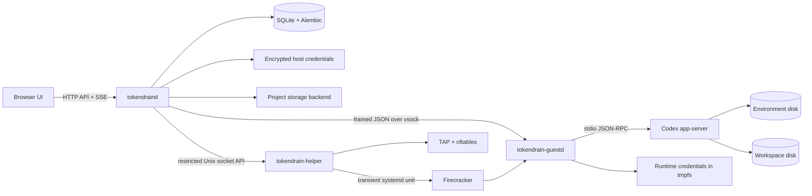
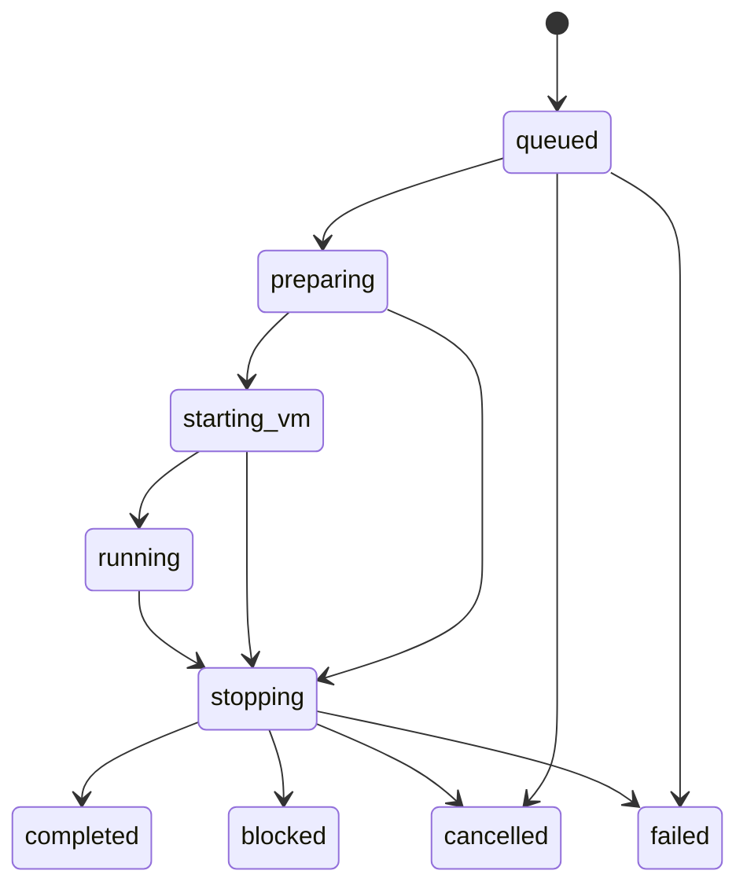

# Architecture

Tokendrain is a single-host service. Nix supplies the platform; the running application creates and manages projects. The host owns scheduling and long-lived credentials. Every execution boots a fresh microVM with the selected project's existing environment and workspace disks.

## Components and boundaries



| Component | Responsibilities | Authority |
| --- | --- | --- |
| `tokendraind` | API, UI, projects, runs, scheduling, account refresh, GitHub broker, reports and events | Unprivileged service user; can decrypt application credentials |
| `tokendrain-helper` | Bounded VM start/stop/list, read-only diagnostics, TAP policy, transient units, recovery records | Restricted privileged service with fixed operations and validated IDs |
| Firecracker | KVM virtualization and guest devices | Dedicated VMM user, restricted filesystem view and cgroups |
| `tokendrain-guestd` | Codex supervision/proxy, runtime credentials, rotation and shutdown | Root inside one guest |
| Codex and its commands | Autonomous project work | Full guest access, assigned runtime credentials and permitted destinations |

Infrastructure operations sit behind explicit storage, VM, command-runner, and session interfaces. Test backends replace these dependencies without creating a separate execution architecture.

## Persistent state

The default state directory is `/var/lib/tokendrain`:

```text
tokendrain.sqlite3           Projects, runs, reports, events, settings
credentials/                Versioned encrypted credential records
admin-token                 Owner-level control-plane token, mode 0600
host-id                     Stable OpenAI public-client host identifier
daemon.lock                 Exclusive application-state ownership
locks/<project-id>.lock     Cross-process project storage leases
projects/<project-id>/
    environment.img         Tools, home, Nix state and Codex threads
    workspace.img           Source tree and project data
    snapshots/<snapshot-id>/
        environment.img
        workspace.img
        metadata.json
```

The default master key is separate at `/var/lib/tokendrain-keys/master.key` and reaches the daemon through a systemd runtime credential. VM records/sockets live under `/run/tokendrain-vms`; host authentication subprocesses use `/run/tokendrain-auth`. Guest runtime files are in the guest's `/run/tokendrain` tmpfs.

SQLite contains relational projects, runs, executions, reports, usage observations, schedules, events, snapshot metadata, secret metadata, GitHub app/installations/project bindings, and settings. A project execution holds its model/reasoning configuration; project and execution records retain Codex thread IDs. OpenAI account records are encrypted files, not plaintext database rows. JSON columns hold typed flexible structures such as run templates, provider observations, reports, and environment metadata.

Alembic migrations run before work is admitted. SQLite foreign keys, WAL, transactions, and uniqueness constraints provide durable coordination. Database transactions do not remain open across VM boot, network requests, or filesystem copies.

## Runs and executions

One run selects projects and a shared stopping policy. Each project gets its own execution, model, reasoning setting, VM, thread, status, report, and observations. A partial unique database index prevents a project from belonging to multiple queued or active executions.

Executions follow validated transitions:



Run status aggregates its executions. Normal budget exhaustion completes an execution window even if the project still has remaining work. Goal completion is a separate fact in the agent report.

The supervisor owns execution tasks through structured concurrency. It enforces global concurrency; the helper independently enforces platform maxima and aggregate memory reservations. A sequential run admits one of its own executions at a time, while unrelated runs may use other slots.

## Work lifecycle

1. Reserve the project in SQLite and acquire its asyncio/process storage lease.
2. Snapshot both offline disks. Snapshot preparation failure fails the execution before boot.
3. Boot the immutable guest with persistent disks and bounded resources.
4. Connect over vsock, inject runtime credentials, and start Codex app-server.
5. Resume the saved thread when available or start one. Supply the goal, task log, feedback, previous state, integration capabilities, and secret names/descriptions.
6. Read actual provider limits and request a substantial autonomous work unit. Save structured progress, then continue while the policy permits another turn.
7. Stop Codex, clear managed runtime credentials, stop the guest, and confirm VMM exit before releasing the project.

The agent inspects current files and processes before acting. Durable project state supplies context instead of continually replaying historical conversations. Feedback is cleared only after a turn returns a result, and only if its text still matches the instructions supplied to that session. A boot, authentication, or budget failure before any result leaves the feedback available for another run. Concurrently edited feedback is retained. Agent task-log updates compare against the last observed text so they do not overwrite a newer user edit.

Reports include summary, completed/remaining work, blockers, change counts and commits when available, next action, task log, and usage observations. Malformed model output becomes an incomplete report; it cannot prove completion. Earlier progress survives a subsequent provider or infrastructure failure.

## Budget boundaries

Usage rules select a limit identifier and/or provider-reported window duration, then compare used percentage. Multiple rules use ANY semantics. Tokendrain assigns no fixed meaning to `primary` or `secondary` windows.

Elapsed runtime is shared by the run, beginning when its first execution starts preparation. Preparation and earlier sequential executions consume that same allowance. It is evaluated before another turn, so an in-progress useful turn can finish after the threshold. A separate turn watchdog handles overlong turns; cancellation and expiring credentials have their own interruption paths.

Account usage can change through other projects or external Codex sessions. Read responses and update notifications feed persisted observations. A percentage rule without an observable matching window fails visibly. Provider refusal and project completion are always natural boundaries. See [OpenAI authentication](openai-auth.md) for differences between account modes.

## Authentication and rotation

The host owns long-lived OpenAI and GitHub credentials. Guests receive current OpenAI access tokens, scoped GitHub installation tokens, and explicitly assigned generic secrets. Refresh tokens, imported master auth files, the application encryption key, and GitHub App private keys never enter a VM.

Per-account locks serialize OpenAI refresh. Rotation normally occurs at a turn boundary. When expiry requires interruption, the host waits for the terminal event, restarts and initializes Codex, and resumes the thread. The next request inspects existing work instead of replaying the interrupted action.

The GitHub provider centralizes and serializes token issuance for scoped project bindings. Guestd updates runtime Git credentials and process environment on rotation. Secret values enter the runtime environment; prompts contain their names and intended uses.

Replacing or disconnecting the OpenAI account, changing the GitHub App, and refreshing GitHub installation discovery require every execution to be terminal, including queued executions. A durable credential-change reservation prevents new runs from starting while those operations are in progress. This gate does not block automatic runtime token refresh. Changing one project's repository binding requires that project to be idle.

Adding, editing or deleting generic secrets also requires the affected project to be idle. Secret metadata changes and Run admission serialize in SQLite, so a queued execution cannot lose a credential while preparing its runtime environment. Values staged before a rejected change are removed unless the database already references them; an unavailable database leaves an encrypted orphan instead of risking deletion of a live credential.

## Scheduling

A schedule stores a five-field cron expression, IANA timezone, enabled state, next occurrence, and ordinary run template. Creating the run and advancing the trigger happen transactionally. A unique schedule/occurrence key prevents duplicates.

Downtime is coalesced into one due occurrence rather than replaying every missed tick. If a selected project is already queued or running, the occurrence is skipped, an event records why, and the schedule advances. Local timezone matching skips nonexistent DST times; a repeated local time can trigger at two distinct UTC instants.

## Storage and restart recovery

Environment and workspace are separately manageable ext4 images. Snapshots use reflink copies with a sparse ordinary-copy fallback. Restore stages replacements and commits a durable journal before changing disks. Directory fsync ordering and cancellation-safe offloaded I/O retain the journal and lease until mutations finish.

On startup, the supervisor reconciles helper records and surviving VM services. It stops those machines before releasing reservations or admitting work. Interrupted active executions become failed with their disks preserved; queued executions remain available. Unconfirmed teardown keeps recovery blocked and the project reserved. Side-effecting turns are never automatically replayed after connection or process failure.

The helper writes root-owned records before resource creation, validates disk paths using pinned descriptors, and performs idempotent cleanup. [MicroVM operations](microvms.md) documents transient units, network policy, persistence, and KVM tests.

## API and browser

FastAPI exposes `/api/v1` and serves the packaged Vite build from the same origin. Administration-token login establishes an HttpOnly cookie. Mutations carry an explicit request header and undergo origin checks.

Events are persisted before notification. SSE uses database IDs for replay and comment heartbeats. The browser coalesces invalidation events, loads bounded historical logs, and appends live events. It does not poll every second. See [web/API.md](../web/API.md) for the full contract.

There is one administrator trust domain per installation. VM separation is not a multi-user authorization system for the control plane.
