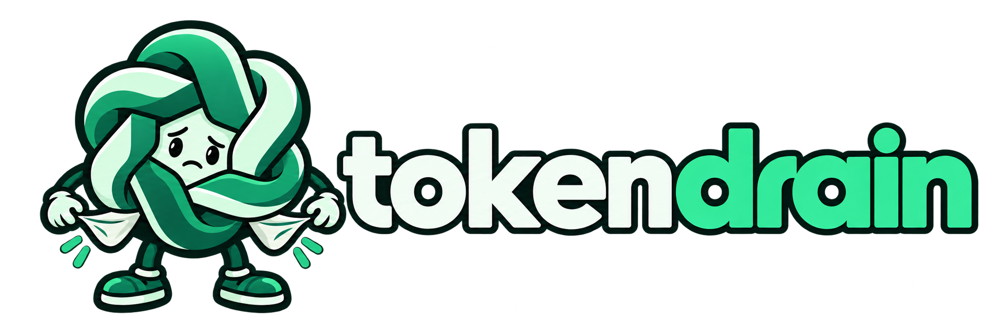

---
hide:
  - navigation
  - toc
---

SELF-HOSTED · NIXOS · FIRECRACKER

# Give your leftover allowance a job.

Autonomous Codex work, on your terms. Approve the tasks, choose the limits, and keep a workspace that is ready for the next Run.

[Get started](getting-started.md){ .md-button .md-button--primary }
[How it works](workflow.md){ .md-button }

  
  

### Your tasks. Your call.

Agents work In progress and Todo. Discoveries stay in Backlog until you approve them.

[Plan the work →](workflow.md)

### A persistent development machine.

Each execution boots a Firecracker VM. The entire project machine persists, while Tokendrain control software is current at every Run and managed credentials are temporary.

[Understand persistence →](microvms.md)

### Know when to stop.

Set usage thresholds and runtime limits. Choose a bounded wrap-up or hard interruption when a threshold is observed.

[Choose your limits →](usage-limits.md)

## Find your next step

| You want to… | Start here |
| --- | --- |
| Install tokendrain on a NixOS host | [Installation and first Run](getting-started.md) |
| Connect your Codex account | [Authentication and usage](openai-auth.md) |
| Give a project GitHub access | [GitHub App setup](github-app.md) |
| Back up or restore project state | [Security and backups](security.md) · [MicroVM operations](microvms.md) |
| Work on tokendrain itself | [Development guide](development.md) · [Architecture](architecture.md) |

!!! note "Before the first Run"
    The supported host is **NixOS with KVM**. Agents have root inside their VMs and run commands without approval prompts. Read the [security model](security.md) before supplying credentials.
